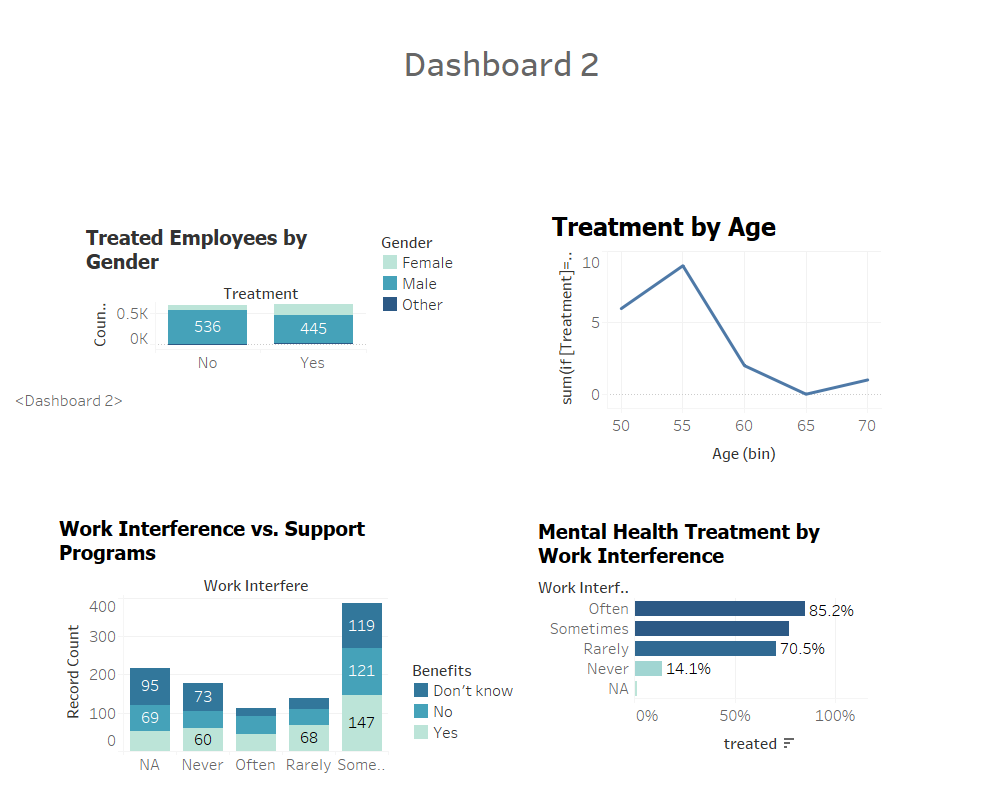

# Mental Health in Tech – Tableau Dashboard

## Overview

This project explores mental health trends within the technology industry using survey data and interactive visualization. The goal is to identify patterns related to workplace support, mental health awareness, and employee attitudes in the tech sector.

The analysis is presented through an interactive Tableau dashboard that transforms raw survey responses into clear and meaningful visual insights.

---

## Objectives

- Analyze mental health related responses from professionals in the technology industry  
- Identify trends in mental health awareness and workplace support  
- Explore how workplace culture and benefits influence mental health outcomes  
- Present insights through interactive Tableau dashboards

---

## Dashboard Insights

### Mental Health Overview


This dashboard presents a high level summary of mental health trends among professionals working in the technology sector. It highlights patterns in awareness, workplace attitudes, and general responses related to mental health.

---

### Treatment Availability by Region



This visualization explores the geographic distribution of mental health treatment availability. It highlights how access to treatment varies across different regions and provides insights into mental health support structures.

---

## Tools and Technologies

- Tableau  
- Data Visualization  
- Exploratory Data Analysis  
- Survey Data Analysis

---

## Repository Structure

```
mental-health-tech-tableau-dashboard
│
├── dashboard
│   Tableau dashboard files
│
├── data
│   Raw and processed datasets used for analysis
│
├── images
│   Dashboard screenshots used in the README
│
├── report
│   Project report and analysis documentation
│
└── CA_1_Mental_health_7416.twbr
    Tableau workbook used to build the dashboard
```

---

## Key Features

- Interactive Tableau dashboards  
- Clear visual representation of survey data  
- Structured repository containing data, dashboards, and documentation  
- Analysis of workplace mental health trends in the technology sector

---

## Project Purpose

This project demonstrates how data visualization tools such as Tableau can transform raw survey data into meaningful insights. The dashboard helps communicate patterns related to workplace mental health and organizational support in the technology industry.

---

## Author

Zeeshan Jamal  
MSc Data Analytics  
Dublin Business School  

